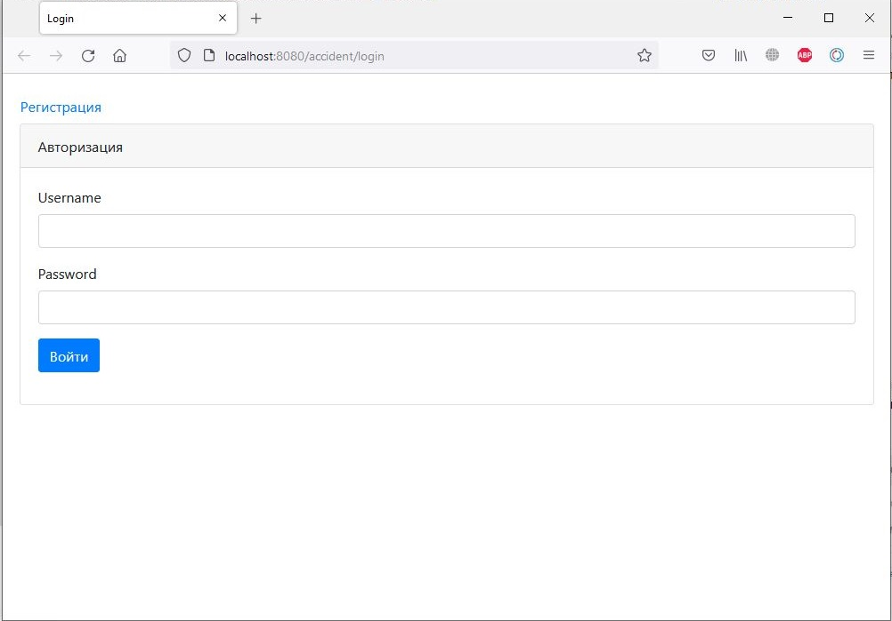
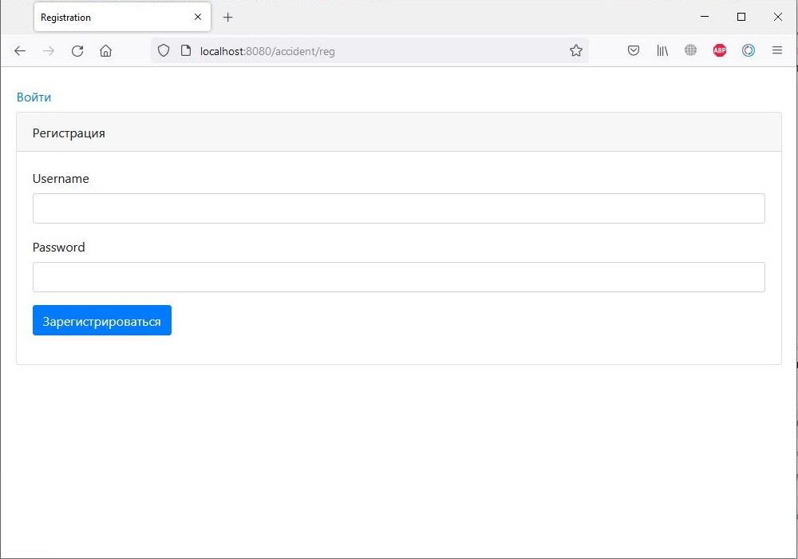
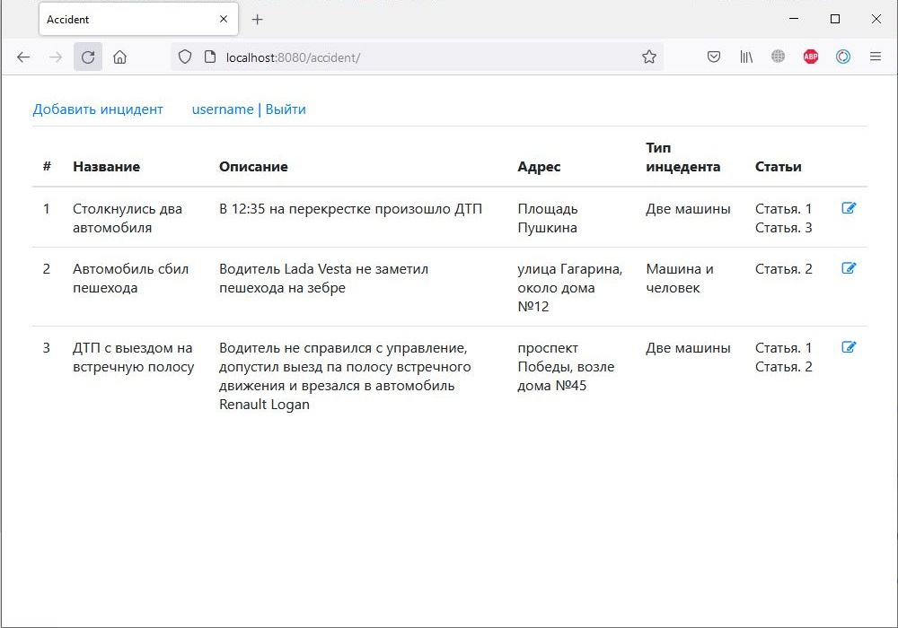
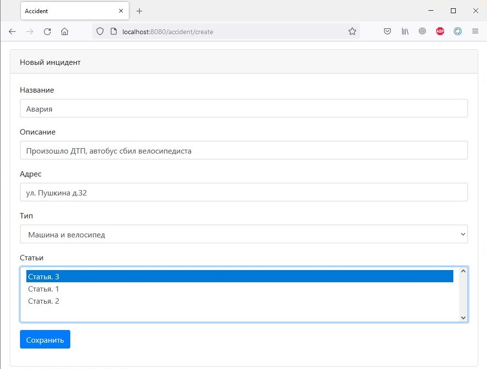
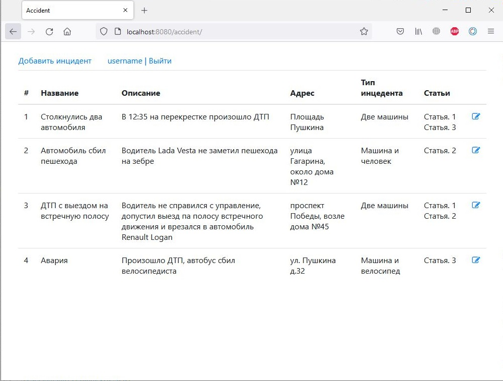

## Описание
Приложение для регистрации нарушений правил дорожного движения. В приложении реализована регистрация и авторизация пользователей, а также добавление записей дорожных инцидентов.

## Технологии
* Java 14
* PostgreSQL
* Hibernate
* Spring Web
* Spring Data JPA
* Spring Security

## Использование
Для использования приложения необходимо войти или зарегистрироваться.

После авторизации пользователь попадает на главную страницу со списком всех инцедентов.

Пользователь может создавать свои инцеденты и редактировать их

